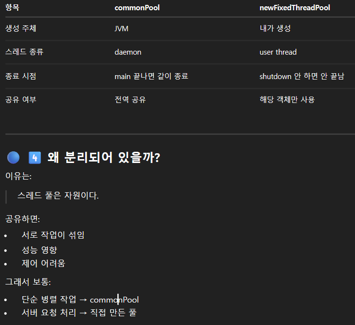
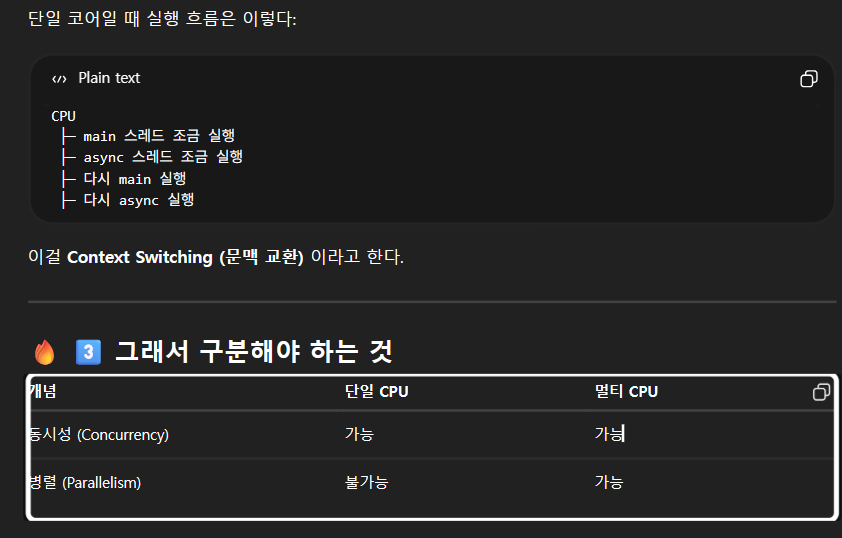

1. 자바 스레드의 종류
```declarative
1. 일반 스레드 (User Thread)
이게 있으면 프로그램이 끝나지 않음

2. Daemon Thread 
일반 스레드 다 끝나면 같이 죽음
(보조 역할, 백그라운드 서비스)

ex. GC (Garbage Collector) = daemon
스레드 풀의 일부 = daemon
로깅 백그라운드 스레드 = daemon
```

2. 프로그램 종료 시점
자바 프로그램은 모든 User Thread가 종료되면 끝난다.
```declarative
new Thread(() -> {
    while(true) {}
}).start()
```

3. CompletabelFuture
```declarative
CompletableFuture.supplyAsync(...)
```
ForkJoinPool.commonPool() 사용.

```declarative
main (user thread)
↓
CompletableFuture
↓
ForkJoinPool.commonPool()
↓
daemon worker threads
```

4. ForkJoinPool.commonPool()?
JVM이 만들어 둔 공용 작업 처리 스레드 풀
= 작업을 잘게 나눠서 병렬로 처리하는 데 특화된 스레드 풀

자바는 JVM을 시작할 때 전역으로 하나의 ForkJoinPool을 만든다.

기본 CPU 코어수 - 1

```declarative
ExecutorService executor = Executors.newFixedThreadPool(4);
```

```declarative
JVM
 ├── ForkJoinPool.commonPool()
 │      ├── worker-1 (daemon)
 │      ├── worker-2
 │
 └── newFixedThreadPool(4)
        ├── thread-1 (user thread)
        ├── thread-2
        ├── thread-3
        ├── thread-4
```


```declarative
서버에서:
1. API 호출 풀
2. DB 작업 풀
3. 비동기 처리 풀
을 각각 분리한다.

한 작업이 풀을 독점하면 다른 작업이 멈출 수 있기 때문에
```

벙렬 작업이 항상 빠른것은 아니다
```declarative
스레드 전환 비용, 락 경쟁, 컨택스트 스위칭, 캐시 미스
```

