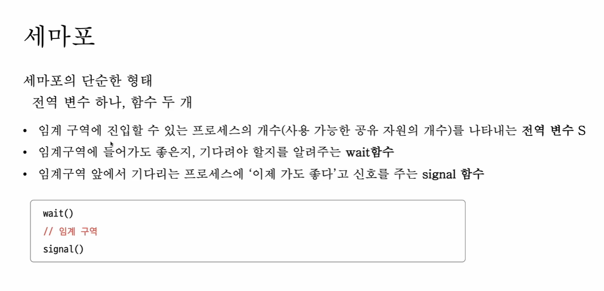
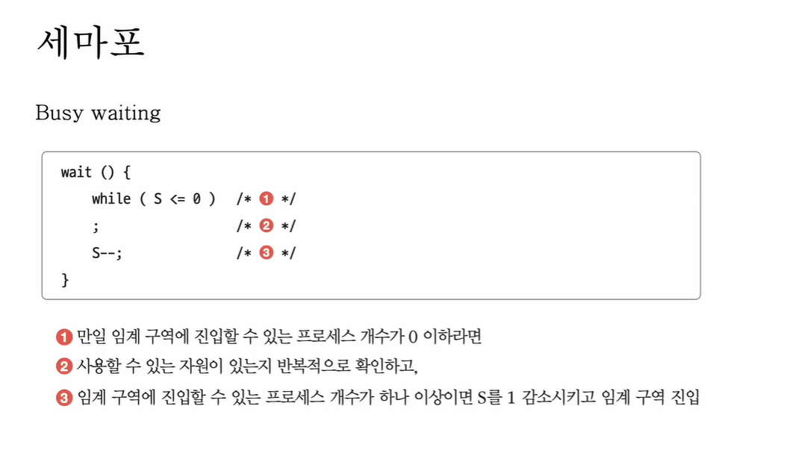
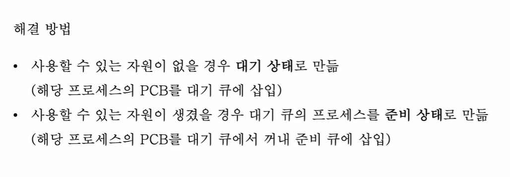

1. 


wait -> 자바의 acquire
signal -> 자바의 release

2.Busy waiting 문제




자바 코드로 대응
```declarative
semaphore.acquire();

permit > 0 이면:
    permit--
    바로 실행

permit == 0 이면:
    현재 스레드 BLOCK 상태
    내부 대기 큐에 삽입
```

```declarative
semaphore.release();

permit++
    대기 중인 스레드가 있으면
    하나 깨워서 READY 상태로 변경
```
3. 큐
```declarative
semaphore.acquire();
```
자바는 논리적 대기 큐를 관리

```declarative
JVM Thread
   ↓
OS Native Thread
```
Ready 큐는 자바가 관리 x .실제 CPU 스케줄링은 OS가 담당.