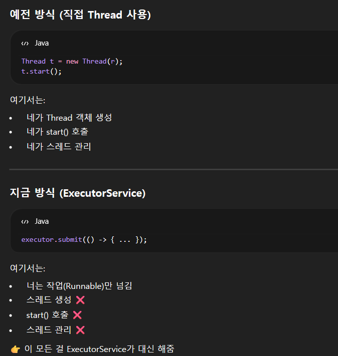

1. ThreadExample 4,5와의 차이점 
```declarative
main thread
↓ submit()
ThreadPoolExecutor
↓
[ 작업 큐 ]
↓
Thread-1
Thread-2
Thread-3
```
스레드를 직접 생성하는 것이 아닌, 작업만 만들고 + 실행은 풀에 맡긴다.

2. 동시 실행 개수 제어
```declarative
Executors.newFixedThreadPool(3);
```
동시에 최대 3개 작업: 서버에서 중요

3. submit()
```declarative
executor.submit(() -> {...});
```
내부적으로 1. Runnable을 만들고 2. Runnable을 작업 큐에 넣는다. 3. 놀고 있는 스레드가 꺼내간다.

